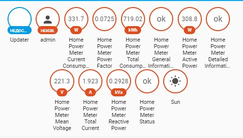

# HomeAssistant Hekr Integration 
> HomeAssistant implementation of Hekr API communicator
>
>[](https://github.com/custom-components/hacs)
>[](https://opensource.org/licenses/MIT)
>[](https://github.com/alryaz/hass-hekr-component/graphs/commit-activity)

## ❗❗❗ WARNING ❗❗❗
**THIS PROJECT IS HIGHLY _WORK-IN-PROGRESS_!!!**
Things are subject to change drastically until at least two to three different Hekr implementations are discovered and
added to the integration as well as the parent python module. Please, read release notes carefully before installing
or upgrading. __I am not responsible for damaging your devices in any way!__


## !!! BREAKING CHANGES IN >=0.2.0 !!!
- Platform setups are no longer supported. Unfortunately, this is a trade-off for supporting accounts.
  When you update to the latest version, a persistent notification will appear containing necessary
  YAML configuration that you can add to your configuration.yaml file.
- Config entry management mechanism vastly overhauled. While this should not influence
  existing setups, it is advised to keep a backup of `core.config_entries` on update.
- From now on, entries created within interface **will override** YAML configuration. This is done
  to facilitate capability of removing YAML entry live and replacing it with different config.

## Contribution

If you found yourself using Wisen application with any of your Smart Home devices, contact me via
e-mail <alryaz@xavux.com>. The process of adding new devices is not yet completely formalized,
the milestone is set for a release-candidate version.

Check original repository with HekrAPI bindings: [hekrapi-python: Hekr protocol bindings for Python](https://github.com/alryaz/hekrapi-python)

## Power meter protocol: `power_meter`


_(more screenshots available at: [images/power_meter](images/power_meter))_

### Example configuration
```yaml
hekr:
  devices:
    - host: home-power-meter.lan
      device_id: ESP_2M_AABBCCDDEEFF
      control_key: 202cb962ac59075b964b07152d234b70
      protocol: power_meter
      sensors:
        - general
        - detailed
      switches: main_power
```

In this state, the plugin will generate three sensors, all obtained via a single `queryDev` command.
These sensors are:
- `status` - **Status** (whether device reports any kind of errors)
- `current_consumption` - **Current Consumption** (current power consumption in *W*)
- `total_consumption` - **Total Consumption** (total energy consumption in *kW*).

Also the following sensors are available, but not enabled by default (as they increase the amount of requests required
to poll the device, leading to infrequent, but possible timeouts):
- `general` - **General Information** (spews out all data available from `queryDev` command)
- `detailed` - **Detailed Information** (spews out all data available from `queryData` command)
- `voltage` - **Voltage** (voltage for every available phase, also mean voltage)
- `current` - **Current** (current for every available phase, also mean current)
- `power_factor` - **Power Factor**
- `active_power` - **Active Power**
- `reactive_power` - **Reactive Power**

Recent release added support for switches, but so far there is only one supported:

- `main_power` - **Main Power** (toggles relay power on and off) 

#### Custom sensors, polling interval and name
```yaml
hekr:
  devices:
    - device_id: ESP_2M_AABBCCDDEEFF
      host: home-power-meter.lan
      control_key: 202cb962ac59075b964b07152d234b70
      scan_interval:
        seconds: 15
      protocol: power_meter
      sensors:
        - general
        - detailed
        - status
        - current_consumption
        - total_consumption
        - voltage
        - current
        - power_factor
        - active_power
        - reactive_power
```

#### Switches, do not add any sensors
```yaml
hekr:
  devices:
    - device_id: ESP_2M_AABBCCDDEEFF
      host: home-power-meter.lan
      control_key: 202cb962ac59075b964b07152d234b70
      scan_interval:
        seconds: 15
      protocol: power_meter
      sensors: false
      switches:
        - main_power
```

## Fetching `device_id` and `control_key` for local setup
**The easiest way to accomplish this is to begin an integration flow with `account` setup type. Tick the box
`Create notification with device info`, and a persistent notification will appear containing compatible YAML config.**

The following tutorial is left for educational purposes / explanation on how protocol decoding was done.

##### Pre-requisites:
- An android device with working Wi-Fi
- Installed _HttpCanary_ application ([Google Play Store link](https://play.google.com/store/apps/details?id=com.guoshi.httpcanary&hl=ru))
- Installed and configured _Wisen_ application ([Google Play Store link](https://play.google.com/store/apps/details?id=me.hekr.hummingbird))
- Configured target device via Wisen application
- Non-isolated access point to communicate with target device

##### Capturing instructions:
1. Open _HttpCanary_ application, and do the following:
   1. ___(required)___ Accept VPN configuration and ___(optional)___ install root certificate
   1. Open `Target Apps` from the side menu
   1. Tap `+` in the top right corner
   1. Search for `Wisen` in the search box, and select _Wisen_ from search results 
   1. Go back to the main screen; you will see _Wisen_'s icon with `Tap the floating button to start capture` text under
      it appear in the middle of your screen. __!!! DO NOT START CAPTURE YET !!!__
1. Force-close and re-open _Wisen_ application, and do the following:
   1. Open `Settings` from the side menu
   1. Open `LAN settings` submenu
   1. Flick the switch to ___on___ position
1. Go back to the _HttpCanary_ application, and start listening by pressing button in the bottom left corner; you will
   now observe `Capturing...` as well as possibly some of cloud Wisen's requests appear on screen; should they not
   appear, go back to _Wisen_ and open up your device from the grid of available devices. After than, enough requests
   will be made to successfully extract needed data.
1. Look for requests with of `WebSocket` type, or `UDP` type to port `10000`. Once you found at least one, open it and
   look for messages containing `ctrlKey` (=`control_key`) and `devTid` (=`device_id`).
   An example response would look something like this, mind the linebreaks:
   ```js
   {
     "msgId": 7,
     "action": "devSend",
     "params": {
       "devTid": "ESP_2M_AABBCCDDEEFF", // This will be your `device_id`
       "appTid": [],
       "subDevTid": null,
       "ctrlKey": "202cb962ac59075b964b07152d234b70", // This will be your `control_key`
       // more data...
     },
     // more data...
   }
   ```
1. __Congratulations, you're ready!__ You can proceed by using any of the configuration methods described above to add
   your device to HomeAssistant. 
## Author

👤 **Alexander Ryyazanov (@alryaz)**

* Github: [@alryaz](https://github.com/alryaz)
* Telegram: [@alryaz](https://t.me/alryaz)

## Show your support

Give a ⭐ if this project helped you!


